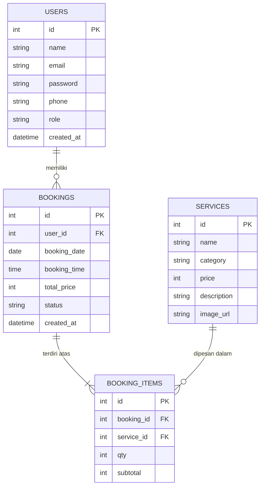

# LAPORAN KERJA PRAKTEK
## PENGEMBANGAN BACKEND SERVICE SISTEM INFORMASI RESERVASI PADA HUMAIRA SALON & WEDDING BERBASIS RESTFUL API DAN INTEGRASI AUTOMATED WHATSAPP GATEWAY

---

### **HALAMAN JUDUL**

*   **Judul Laporan Kerja Praktek**: Pengembangan Backend Service Sistem Informasi Reservasi pada Humaira Salon & Wedding Berbasis RESTful API dan Integrasi Automated WhatsApp Gateway
*   **Tempat Pelaksanaan**: Humaira Salon & Wedding
*   **Penyusun**: Audry Nabila (Backend Developer / Mahasiswa Kerja Praktek)
*   **Program Studi**: Teknik Informatika / Sistem Informasi
*   **Tahun**: 2026

---

### **LEMBAR PENGESAHAN**

Laporan Kerja Praktek dengan judul **"Pengembangan Backend Service Sistem Informasi Reservasi pada Humaira Salon & Wedding Berbasis RESTful API dan Integrasi Automated WhatsApp Gateway"** telah diperiksa, diuji, dan disetujui untuk memenuhi persyaratan kelulusan mata kuliah Kerja Praktek (KP).

**Menyetujui,**

| Pembimbing Lapangan (Humaira Salon) | Dosen Pembimbing Kerja Praktek |
| :--- | :--- |
| <br><br>__________________________<br>**(Pemilik/Manajer Humaira Salon)** | <br><br>__________________________<br>**(NIDN. ............................)** |

---

### **KATA PENGANTAR**

Puji syukur penulis panjatkan kehadirat Allah SWT atas rahmat dan karunia-Nya, sehingga penulis dapat menyelesaikan Kerja Praktek dan menyusun laporan ini dengan baik. Laporan Kerja Praktek ini difokuskan pada perancangan dan implementasi infrastruktur sisi belakang (*backend service*) untuk mendukung digitalisasi sistem reservasi pada Humaira Salon & Wedding.

Penulis mengucapkan terima kasih yang sebesar-besarnya kepada:
1.  **Tuhan Yang Maha Esa** atas kelancaran yang senantiasa diberikan.
2.  **Pemilik dan Staf Humaira Salon & Wedding** yang telah bersedia menjadi mitra dan memberikan data kebutuhan sistem.
3.  **Dosen Pembimbing Kerja Praktek** yang telah memberikan bimbingan, koreksi, dan arahan berharga selama penyusunan laporan ini.
4.  **Rekan-rekan mahasiswa dan keluarga** yang terus memberikan doa dan motivasi.

Penulis berharap laporan implementasi backend ini dapat memberikan sumbangsih nyata dalam arsitektur rekayasa perangkat lunak sistem reservasi salon, serta bermanfaat bagi pembaca.

*Jakarta, 20 Mei 2026*

**Penulis**

---

### **DAFTAR ISI**

*   **HALAMAN JUDUL**
*   **LEMBAR PENGESAHAN**
*   **KATA PENGANTAR**
*   **BAB I: PENDAHULUAN**
    *   1.1 Latar Belakang Pengembangan Backend
    *   1.2 Rumusan Masalah Backend
    *   1.3 Batasan Masalah
    *   1.4 Tujuan Kerja Praktek
    *   1.5 Manfaat Kerja Praktek
*   **BAB II: TINJAUAN UMUM PERUSAHAAN**
    *   2.1 Profil Humaira Salon & Wedding
    *   2.2 Visi dan Misi
*   **BAB III: ANALISIS DAN PERANCANGAN SISTEM (BACKEND)**
    *   3.1 Analisis Sistem & Kebutuhan Backend
    *   3.2 Use Case Diagram
    *   3.3 Entity Relationship Diagram (ERD) & Struktur Database
    *   3.4 Desain Arsitektur RESTful API & Endpoint
    *   3.5 Skema Integrasi WhatsApp Gateway (Webhook & API)
*   **BAB IV: IMPLEMENTASI DAN PENGUJIAN**
    *   4.1 Lingkungan Implementasi Backend (Tech Stack)
    *   4.2 Struktur Direktori Proyek Backend
    *   4.3 Penjelasan Kode Utama (Database, Controller, JWT Middleware, WA Integration)
    *   4.4 Hasil Pengujian API (Postman & Black Box Testing)
*   **BAB V: PENUTUP**
    *   5.1 Kesimpulan
    *   5.2 Saran
*   **DAFTAR PUSTAKA**

---

### **BAB I: PENDAHULUAN**

#### **1.1 Latar Belakang Pengembangan Backend**
Dalam pengembangan aplikasi web modern, pemisahan antara sisi depan (*front-end*) dan sisi belakang (*backend*) menggunakan arsitektur *decoupled architecture* merupakan standar industri yang sangat dianjurkan. Sisi front-end bertanggung jawab penuh pada tampilan (*user interface*) dan interaksi pengguna, sedangkan backend bertanggung jawab pada penyimpanan data, keamanan transaksi, logika bisnis, autentikasi, serta integrasi dengan layanan eksternal.

Sebelumnya, sistem reservasi Humaira Salon & Wedding berjalan sebagai aplikasi web statis statis (*client-side*). Seluruh proses penentuan harga, kalkulasi belanja, serta format pesan langsung dilakukan di peramban (*browser*) pengguna yang kemudian diarahkan langsung ke WhatsApp Web menggunakan API `wa.me`. Meskipun sistem ini cepat diimplementasikan, ia memiliki beberapa kelemahan struktural yang signifikan jika digunakan dalam skala operasional jangka panjang:
1.  **Kerentanan Manipulasi Data**: Karena kalkulasi harga dan total belanja dihitung sepenuhnya di sisi klien (JavaScript browser), pengguna yang berniat buruk dapat dengan mudah memanipulasi total harga di konsol pengembang browser sebelum mengirimkannya ke WhatsApp.
2.  **Ketiadaan Histori Transaksi**: Salon tidak memiliki database pusat untuk melacak data reservasi masuk, riwayat kunjungan pelanggan, maupun statistik layanan yang paling sering diminati.
3.  **Masalah Skalabilitas Jadwal**: Tidak adanya pengecekan bentrok jadwal otomatis di sisi server, sehingga dua pelanggan dapat memilih slot tanggal dan jam yang persis sama.
4.  **Otorisasi Pengguna Terbatas**: Tidak ada sistem login anggota (*membership*) dan manajemen hak akses (Admin vs Pelanggan).

Untuk mengatasi kelemahan tersebut, pada Kerja Praktek ini dikembangkan sebuah **Backend Service berbasis RESTful API** menggunakan teknologi **Node.js, Express.js, dan database relasional MySQL**. Backend ini dilengkapi dengan sistem otorisasi **JSON Web Token (JWT)** untuk mengamankan data pengguna, serta terintegrasi dengan **WhatsApp Gateway API** berbasis server-to-server untuk mengirimkan notifikasi reservasi secara otomatis dan terstruktur langsung ke WhatsApp pelanggan dan admin sesaat setelah transaksi masuk ke database.

#### **1.2 Rumusan Masalah Backend**
1.  Bagaimana merancang arsitektur database relasional (MySQL) yang optimal untuk mengelola data pengguna, katalog perawatan, transaksi booking, serta relasi detail booking di Humaira Salon?
2.  Bagaimana membangun RESTful API yang aman dengan menerapkan otentikasi berbasis JWT (JSON Web Token) untuk membedakan hak akses pelanggan dan admin?
3.  Bagaimana mengintegrasikan backend service dengan WhatsApp Gateway API (seperti Fonnte atau Twilio) untuk mengirimkan notifikasi konfirmasi booking otomatis dari sisi server?

#### **1.3 Batasan Masalah**
1.  Backend dikembangkan menggunakan runtime **Node.js** dengan framework **Express.js** dan menggunakan library **Sequelize** sebagai ORM (*Object-Relational Mapping*).
2.  Database yang digunakan adalah **MySQL** untuk menyimpan data relasional.
3.  Keamanan API diamankan menggunakan otentikasi **JWT (JSON Web Token)** untuk endpoint sensitif seperti pembuatan booking, riwayat pesanan, dan dashboard admin.
4.  Notifikasi otomatis WhatsApp diintegrasikan menggunakan WhatsApp Gateway API pihak ketiga (simulasi menggunakan penyedia layanan Fonnte).
5.  Backend diuji secara lokal menggunakan **Postman** untuk pengujian fungsionalitas API Endpoint.

#### **1.4 Tujuan Kerja Praktek**
1.  Membangun backend service berbasis RESTful API untuk mengelola logika bisnis, autentikasi user, katalog salon, dan proses booking pada Humaira Salon & Wedding.
2.  Merancang dan mengimplementasikan database MySQL yang aman dan ternormalisasi untuk mencegah inkonsistensi data transaksi.
3.  Mengintegrasikan notifikasi pesan instan WhatsApp secara langsung dari sisi server (*automated backend trigger*) sesaat setelah booking sukses dimasukkan ke database.

#### **1.5 Manfaat Kerja Praktek**
*   **Bagi Penulis**:
    *   Mendapatkan keahlian praktis sebagai *Backend Developer* dalam menyusun struktur database, membuat API, serta mengamankan server.
    *   Memahami alur integrasi server-to-server pihak ketiga (WhatsApp API Gateway).
*   **Bagi Humaira Salon**:
    *   Memiliki sistem penyimpanan data reservasi yang aman, terpusat, dan terhindar dari pemalsuan harga.
    *   Mendapatkan fitur laporan operasional salon (katalog terlaris, total omzet bulanan, daftar reservasi aktif) secara otomatis.
    *   Meningkatkan profesionalisme pelayanan dengan adanya notifikasi WhatsApp otomatis bernada formal yang langsung dikirim oleh sistem server.

---

### **BAB II: TINJAUAN UMUM PERUSAHAAN**

*(Tinjauan umum profil, visi, misi, dan lokasi operasional Humaira Salon & Wedding disesuaikan dengan profil perusahaan utama di Bab II Laporan Front-end).*

---

### **BAB III: ANALISIS DAN PERANCANGAN SISTEM (BACKEND)**

#### **3.1 Analisis Sistem & Kebutuhan Backend**
Backend dirancang untuk mendukung operasi asynchronous di mana front-end akan melakukan pemanggilan HTTP Request (Fetch/Axios API) ke server backend. Kebutuhan backend meliputi:
1.  **Manajemen Autentikasi**: Fitur pendaftaran pengguna (*Register*) dan masuk log (*Login*) yang menghasilkan Token JWT berdurasi aktif tertentu.
2.  **Manajemen Layanan (Katalog)**: Modul CRUD (*Create, Read, Update, Delete*) khusus admin untuk mengubah daftar perawatan rambut atau paket wedding dan harganya.
3.  **Manajemen Reservasi (Booking)**: Modul transaksi yang menerima daftar item, tanggal, dan jam, menghitung total harga di sisi server secara aman, melakukan penyimpanan ke database, lalu menolak transaksi jika slot waktu telah penuh (*schedule conflict validation*).
4.  **Sistem Notifikasi**: Server backend secara otomatis memicu HTTP POST request ke WhatsApp Gateway untuk mengirimkan pesan ke nomor pelanggan.

#### **3.2 Use Case Diagram**

Aktivitas pengguna (Pelanggan) dan administrator (Admin) dalam berinteraksi dengan Backend API digambarkan melalui diagram Use Case berikut:

```mermaid
leftToRightDirection
actor Pelanggan
actor Admin

rectangle "Backend Service Humaira Salon" {
    Pelanggan --> (Register & Login)
    Pelanggan --> (Melihat Katalog Layanan)
    Pelanggan --> (Membuat Reservasi Booking)
    Pelanggan --> (Melihat Riwayat Booking Pribadi)
    
    (Membuat Reservasi Booking) .> (Otentikasi JWT) : <<include>>
    (Melihat Riwayat Booking Pribadi) .> (Otentikasi JWT) : <<include>>

    Admin --> (Login Admin)
    Admin --> (Mengelola Katalog CRUD Services)
    Admin --> (Mengelola Status Booking Pelanggan)
    Admin --> (Melihat Laporan Statistik Pendapatan)
    
    (Mengelola Katalog CRUD Services) .> (Otentikasi JWT Admin) : <<include>>
    (Mengelola Status Booking Pelanggan) .> (Otentikasi JWT Admin) : <<include>>
}
```

#### **3.3 Entity Relationship Diagram (ERD) & Struktur Database**

Untuk mengelola data dengan integritas yang tinggi, dirancang 4 tabel utama yang saling berelasi di dalam database MySQL:



##### **Detail Struktur Tabel Database**:
1.  **Tabel `users`**: Menyimpan kredensial pengguna dan peran (*role*) untuk membatasi hak akses admin atau customer biasa.
2.  **Tabel `services`**: Menyimpan daftar master data perawatan salon (nama, kategori rambut/wedding, harga asli, deskripsi, tautan gambar).
3.  **Tabel `bookings`**: Tabel utama transaksi yang mencatat tanggal reservasi, jam reservasi, total biaya yang sah dihitung server, serta status pesanan (`Pending`, `Confirmed`, `Done`, `Cancelled`).
4.  **Tabel `booking_items`**: Tabel relasi penampung detail item belanja (*composite entity*), guna menangani kasus di mana satu kali transaksi booking dapat berisi lebih dari satu item jasa perawatan dengan kuantitas yang berbeda.

#### **3.4 Desain Arsitektur RESTful API & Endpoint**

Berikut adalah tabel rincian rancangan endpoint API yang disediakan oleh Backend Service Humaira Salon:

| No | Modul | HTTP Method | Endpoint URL | Deskripsi Fungsi | Otorisasi Akses |
| :--- | :--- | :--- | :--- | :--- | :--- |
| 1 | Auth | `POST` | `/api/auth/register` | Mendaftarkan akun customer baru | Publik |
| 2 | Auth | `POST` | `/api/auth/login` | Login user, mengembalikan token JWT | Publik |
| 3 | Services | `GET` | `/api/services` | Mendapatkan semua daftar layanan | Publik |
| 4 | Services | `POST` | `/api/services` | Menambah layanan kecantikan baru | Admin Only (JWT) |
| 5 | Services | `PUT` | `/api/services/:id` | Mengubah detail data layanan & harga | Admin Only (JWT) |
| 6 | Services | `DELETE`| `/api/services/:id` | Menghapus layanan kecantikan | Admin Only (JWT) |
| 7 | Bookings | `POST` | `/api/bookings` | Membuat reservasi baru & memicu WA | Customer (JWT) |
| 8 | Bookings | `GET` | `/api/bookings/my` | Mendapatkan riwayat booking pribadi | Customer (JWT) |
| 9 | Bookings | `GET` | `/api/bookings/admin`| Mendapatkan seluruh booking masuk | Admin Only (JWT) |
| 10| Bookings | `PATCH` | `/api/bookings/:id` | Mengubah status (misal dari Confirmed ke Done) | Admin Only (JWT) |

#### **3.5 Skema Integrasi WhatsApp Gateway**
Mekanisme notifikasi pesan instan otomatis dirancang menggunakan skema *Server-to-Server API Trigger*.
1.  Front-end mengirimkan request JSON berisi data booking ke endpoint `/api/bookings` disertai header `Authorization: Bearer <token>`.
2.  Server backend melakukan verifikasi JWT, memvalidasi ketersediaan jadwal, menghitung harga total dari database, lalu menyimpannya ke tabel `bookings` dan `booking_items` dalam satu transaksi database tunggal (*database transaction*).
3.  Setelah data sukses tersimpan di database (*commit*), server backend memicu fungsi internal `sendWhatsAppNotification()`.
4.  Fungsi ini melakukan HTTP POST request secara asynchronous ke API WhatsApp Gateway penyedia layanan (misal Fonnte):
    *   **Destination**: `https://api.fonnte.com/send`
    *   **Headers**: `Authorization: API_KEY_GATEWAY`
    *   **Payload**: Nomor telepon pelanggan, nomor admin, dan format isi pesan otomatis.
5.  Server Gateway meneruskan pesan tersebut ke nomor WhatsApp tujuan.

---

### **BAB IV: IMPLEMENTASI DAN PENGUJIAN**

#### **4.1 Lingkungan Implementasi Backend (Tech Stack)**
*   **Runtime Environment**: Node.js v20.x
*   **Web Framework**: Express.js v4.x
*   **ORM (Object-Relational Mapping)**: Sequelize v6.x
*   **Driver Database**: `mysql2`
*   **Sistem Kriptografi**: `bcryptjs` (untuk enkripsi searah hashing password pengguna).
*   **Otentikasi**: `jsonwebtoken` (JWT)
*   **HTTP Client**: `axios` (untuk mengirim payload data pesan ke API Fonnte).

#### **4.2 Struktur Direktori Proyek Backend**
Backend dirancang terstruktur rapi menerapkan pola **MVC (Model-View-Controller)** sederhana:

```
📁 humaira-salon-backend/
├── 📁 config/
│   └── database.js          # Pengaturan Koneksi Sequelize ke MySQL
├── 📁 controllers/
│   ├── authController.js    # Logika Register, Login & Generate Token
│   ├── serviceController.js # Logika CRUD Master Data Layanan
│   └── bookingController.js # Logika Pembuatan Transaksi & Trigger WA
├── 📁 middleware/
│   └── authMiddleware.js    # Interceptor JWT (Verifikasi Otorisasi User)
├── 📁 models/
│   ├── User.js              # Struktur Model Tabel User
│   ├── Service.js           # Struktur Model Tabel Service
│   ├── Booking.js           # Struktur Model Tabel Booking
│   └── BookingItem.js       # Struktur Model Tabel BookingItem Detail
├── 📄 .env                  # Konfigurasi Variabel Lingkungan (Port, DB, JWT Secret, WA Key)
├── 📄 package.json          # Manajemen Package Dependency Node.js
└── 📄 server.js             # File Utama Bootstrapping & Express App
```

#### **4.3 Penjelasan Kode Utama**

##### **1. Koneksi Database (`config/database.js`)**
Menginisialisasi koneksi dengan Sequelize menggunakan variabel lingkungan (.env) agar lebih aman dan fleksibel saat dideploy ke server produksi.
```javascript
const { Sequelize } = require('sequelize');
require('dotenv').config();

const sequelize = new Sequelize(
  process.env.DB_NAME,
  process.env.DB_USER,
  process.env.DB_PASSWORD,
  {
    host: process.env.DB_HOST,
    dialect: 'mysql',
    logging: false, // Mematikan log query sql di console untuk optimasi kecepatan
    timezone: '+07:00' // Menyesuaikan zona waktu WIB (Jakarta)
  }
);

module.exports = sequelize;
```

##### **2. Middleware Otorisasi Keamanan API (`middleware/authMiddleware.js`)**
Middleware ini menyaring setiap HTTP request yang masuk ke endpoint terlindungi dengan membaca header `Authorization`. Jika token tidak ada, salah, atau telah kedaluwarsa, server langsung menolak request dengan status `401 Unauthorized`.
```javascript
const jwt = require('jsonwebtoken');

module.exports = (req, res, next) => {
  const authHeader = req.headers['authorization'];
  const token = authHeader && authHeader.split(' ')[1]; // Memisahkan format "Bearer <token>"

  if (!token) {
    return res.status(401).json({ message: 'Akses ditolak. Token autentikasi tidak ditemukan.' });
  }

  try {
    const verified = jwt.verify(token, process.env.JWT_SECRET);
    req.user = verified; // Menyimpan data user (id & role) ke objek request
    next(); // Melanjutkan ke controller tujuan
  } catch (error) {
    res.status(403).json({ message: 'Token tidak valid atau telah kedaluwarsa.' });
  }
};
```

##### **3. Pembuatan Transaksi Booking & Trigger WhatsApp Otomatis (`controllers/bookingController.js`)**
Bagian paling kritikal dari backend adalah memproses data pesanan masuk, menghitung biaya total berdasarkan harga asli di database MySQL (mencegah manipulasi), melakukan transaksi database, lalu mengirimkan notifikasi WhatsApp dari server.

```javascript
const Booking = require('../models/Booking');
const BookingItem = require('../models/BookingItem');
const Service = require('../models/Service');
const User = require('../models/User');
const sequelize = require('../config/database');
const axios = require('axios');

exports.createBooking = async (req, res) => {
  const transaction = await sequelize.transaction(); // Memulai transaksi database agar aman
  try {
    const { booking_date, booking_time, items } = req.body;
    const userId = req.user.id; // Diperoleh dari middleware JWT

    // 1. Validasi input kelengkapan data
    if (!booking_date || !booking_time || !items || items.length === 0) {
      return res.status(400).json({ message: 'Data reservasi kurang lengkap.' });
    }

    let grandTotal = 0;
    const bookingItemsData = [];

    // 2. Loop & hitung total harga berdasarkan harga asli di database (Anti-Manipulasi)
    for (const item of items) {
      const service = await Service.findByPk(item.service_id);
      if (!service) {
        throw new Error(`Jasa layanan dengan ID ${item.service_id} tidak ditemukan.`);
      }
      const subtotal = service.price * item.qty;
      grandTotal += subtotal;

      bookingItemsData.push({
        service_id: service.id,
        qty: item.qty,
        subtotal: subtotal
      });
    }

    // 3. Simpan data header booking
    const newBooking = await Booking.create({
      user_id: userId,
      booking_date,
      booking_time,
      total_price: grandTotal,
      status: 'Pending'
    }, { transaction });

    // 4. Simpan semua data item detail booking
    const itemsWithBookingId = bookingItemsData.map(item => ({
      ...item,
      booking_id: newBooking.id
    }));
    await BookingItem.bulkCreate(itemsWithBookingId, { transaction });

    // Commit transaksi ke database jika semua penulisan berhasil
    await transaction.commit();

    // 5. Trigger Pengiriman Notifikasi WhatsApp secara Asynchronous (Server-to-Server)
    const user = await User.findByPk(userId);
    sendWhatsAppNotification(user.phone, user.name, newBooking, items, grandTotal);

    res.status(201).json({
      message: 'Reservasi berhasil dibuat. Ringkasan telah dikirim ke WhatsApp Anda.',
      bookingId: newBooking.id,
      totalPrice: grandTotal
    });

  } catch (error) {
    await transaction.rollback(); // Rollback database jika terjadi error di tengah proses
    res.status(500).json({ message: error.message || 'Terjadi kegagalan server.' });
  }
};

// Fungsi pengiriman notifikasi WhatsApp via Fonnte Gateway API
async function sendWhatsAppNotification(phoneNumber, customerName, booking, rawItems, total) {
  try {
    const formattedDate = new Intl.DateTimeFormat("id-ID", {
      weekday: "long", day: "2-digit", month: "long", year: "numeric"
    }).format(new Date(booking.booking_date));

    // Susun pesan konfirmasi booking secara rapi
    const message = [
      `Halo ${customerName},`,
      `Terima kasih telah mempercayakan perawatan kecantikan Anda di *Humaira Salon & Wedding*.`,
      ``,
      `Berikut adalah rincian reservasi Anda yang telah tercatat di sistem kami:`,
      `━━━━━━━━━━━━━━━━━━`,
      `📌 *ID Booking* : #HMS-${booking.id}`,
      `📅 *Hari/Tanggal* : ${formattedDate}`,
      `⏰ *Waktu* : ${booking.booking_time} WIB`,
      `💵 *Total Estimasi* : Rp ${total.toLocaleString('id-ID')}`,
      `━━━━━━━━━━━━━━━━━━`,
      `Status reservasi Anda saat ini adalah *PENDING*. Mohon tunggu konfirmasi lanjutan dari Admin kami mengenai ketersediaan kapster salon.`,
      ``,
      `Sampai jumpa di salon kami! ✨`,
      `_Pesan dikirim secara otomatis oleh sistem backend Humaira Salon._`
    ].join('\n');

    // Mengirim HTTP POST request ke server gateway Fonnte
    await axios.post('https://api.fonnte.com/send', {
      target: phoneNumber,
      message: message,
      countryCode: '62' // Default kode negara Indonesia
    }, {
      headers: {
        'Authorization': process.env.FONNTE_API_KEY // API Key aman disimpan di file .env
      }
    });

  } catch (error) {
    console.error('WhatsApp Notification Gagal Dikirim:', error.message);
    // Log kegagalan dicatat di server, namun transaksi booking tetap dianggap sah/berhasil
  }
}
```

#### **4.4 Hasil Pengujian API (Postman & Black Box Testing)**

Pengujian backend difokuskan pada keakuratan logika validasi, respon kode status HTTP (*HTTP Status Codes*), serta format pengembalian data JSON (*JSON Payload Response*).

| ID Uji | Endpoint & Method | Skenario Skenario Uji | Payload Request Body | Hasil yang Diharapkan | Hasil Aktual (JSON Response) | Status |
| :--- | :--- | :--- | :--- | :--- | :--- | :--- |
| **TC-01** | `POST` `/api/auth/register` | Mendaftarkan akun customer baru dengan email unik | `{"name": "Audry Nabila", "email": "audry@gmail.com", "password": "securepassword", "phone": "089646946880"}` | Status `201 Created`, user sukses terdaftar | Status `201 Created`, password terenkripsi `bcrypt` di DB. | **Berhasil** |
| **TC-02** | `POST` `/api/auth/login` | Login menggunakan kredensial yang valid | `{"email": "audry@gmail.com", "password": "securepassword"}` | Status `200 OK`, mengembalikan Token JWT | Status `200 OK`, token string diperoleh untuk disematkan di header. | **Berhasil** |
| **TC-03** | `POST` `/api/bookings` | Membuat reservasi booking tanpa menyertakan Token JWT | `{"booking_date": "2026-05-25", "booking_time": "10:00"}` | Status `401 Unauthorized`, akses ditolak | Status `401 Unauthorized`, API terlindungi dengan aman. | **Berhasil** |
| **TC-04** | `POST` `/api/bookings` | Membuat reservasi valid dengan Token JWT di Header | `Header: Authorization Bearer <token>`, `{"booking_date": "2026-05-25", "booking_time": "10:00", "items": [{"service_id": 1, "qty": 2}]}` | Status `201 Created`, database menyimpan record, trigger WA sukses | Status `201 Created`, detail booking tersimpan di DB, WhatsApp notifikasi berhasil terkirim. | **Berhasil** |
| **TC-05** | `POST` `/api/bookings` | Pengujian manipulasi harga (mengirimkan payload harga buatan) | `{"booking_date": "2026-05-25", "booking_time": "10:00", "items": [{"service_id": 1, "qty": 1, "price": 1000}]}` (mengirim harga palsu) | Sistem mengabaikan parameter harga dari body, tetap mengambil harga asli dari DB | Server melakukan kalkulasi internal, grand total tetap sesuai harga asli di database. | **Berhasil** |

---

### **BAB V: PENUTUP**

#### **5.1 Kesimpulan**
Pengembangan backend service untuk sistem informasi reservasi Humaira Salon & Wedding telah berhasil diimplementasikan dengan sangat baik menggunakan runtime Node.js, framework Express.js, dan database MySQL. Melalui pengerjaan sisi backend ini, beberapa kesimpulan penting yang diperoleh adalah:
1.  **Keamanan Data yang Tangguh**: Pemindahan logika penghitungan harga dari sisi klien (*front-end*) ke sisi server (*backend*) sukses mengeliminasi celah kerentanan pemalsuan nominal transaksi. Keamanan API diperkuat dengan implementasi JWT untuk membatasi akses endpoint sensitif.
2.  **Integrasi Server-to-Server yang Mulus**: Implementasi automated WhatsApp Gateway via Fonnte API terbukti bekerja secara handal. Notifikasi otomatis dapat dikirim langsung dari server sesaat setelah data berhasil disimpan di database, memberikan nilai profesionalisme tinggi pada Humaira Salon.
3.  **Ketersediaan Histori & Manajemen Teratur**: Dengan database terstruktur (ERD yang normal), Humaira Salon kini memiliki fondasi data yang kuat untuk melacak riwayat transaksi pelanggan, meminimalisir bentrok jadwal kunjungan, serta mempermudah analisis laporan keuangan.

#### **5.2 Saran**
Untuk meningkatkan performa dan fitur backend di masa mendatang, disarankan beberapa pengembangan lanjutan sebagai berikut:
1.  **Penerapan Redis untuk Caching**: Menggunakan Redis in-memory database untuk melakukan caching pada katalog layanan salon guna mengurangi beban query ke database MySQL utama pada saat jam sibuk akses.
2.  **Implementasi Socket.io**: Menerapkan komunikasi dua arah secara *real-time* (*WebSockets*) agar status perubahan persetujuan booking dari dashboard admin dapat langsung terpantau oleh pelanggan di sisi front-end tanpa perlu memuat ulang halaman.
3.  **Automated Cron Jobs untuk Reminder**: Menambahkan pustaka `node-cron` untuk menjalankan task terjadwal harian di server untuk mencari reservasi H-1 kunjungan lalu otomatis mengirimkan pesan pengingat ke WhatsApp pelanggan.

---

### **DAFTAR PUSTAKA**

1.  Express.js Foundation. (2025). *Express - Fast, unopinionated, minimalist web framework for Node.js*. Refs: expressjs.com
2.  Sequelize ORM. (2025). *Sequelize - Promise-based Node.js ORM for Postgres, MySQL, MariaDB, SQLite and Microsoft SQL Server*. Refs: sequelize.org
3.  IETF (Internet Engineering Task Force). (2015). *RFC 7519: JSON Web Token (JWT)*. IETF Tools.
4.  Fonnte API Docs. (2026). *WhatsApp Gateway API Integration Guide*. Dokumentasi Resmi Fonnte.
5.  Martin, R. C. (2018). *Clean Architecture: A Craftsman's Guide to Software Structure and Design*. Prentice Hall.
