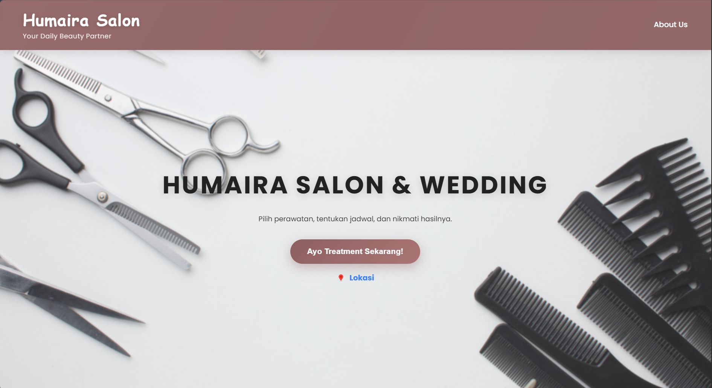

# Humaira Salon Website

A simple and elegant business website developed for Humaira Salon UMKM with responsive design and user-friendly UI/UX.

This website was created based on the client's preferences to provide a clean, modern, and accessible browsing experience for customers of all backgrounds.

---

## Features

- Responsive design for mobile and desktop
- Clean and elegant user interface
- User-friendly navigation
- WhatsApp chatbot integration
- Salon information and services
- Contact and social media section
- Simple and accessible customer experience

---

## Tech Stack

- HTML
- CSS
- JavaScript

---

## Project Goals

The goal of this project is to help improve Humaira Salon's online presence through a modern website with simple navigation and comfortable user experience.

---

## UI/UX Focus

This website was designed with:
- simple and modern layout
- easy navigation
- responsive mobile experience
- accessibility for non-technical users
- fast and comfortable interaction

---

## Project Status

Currently under development and continuously improving based on client feedback and requirements.

---

## Screenshots

